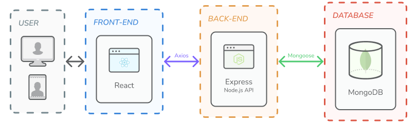
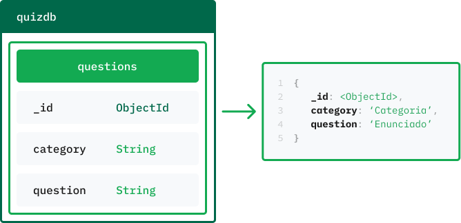

# :seedling: TechMatch - API

### [About](#information_source-about-the-app) • [Features](#heavy_check_mark-features) • [Technologies](#gear-technologies) • [Endpoints](#door-endpoints) • [Schemas](#bricks-schemas) • [Author](#star2-author)

## :information_source: About The App

  

**API** developed for the webapp **TechMatch**, with a database that relays on the **MongoDB Atlas** cloud. [Swagger documentation](https://techmatch-api.onrender.com/docs/) available online.
> :rocket: Available online on [Render](https://techmatch-api.onrender.com)!

The **front-end** of the application can be found at its [GitHub repository](https://github.com/camilafbarcellos/techmatch).
> :rocket: Available online on [Vercel](https://techmatch.vercel.app/)!

    

## :heavy_check_mark: Features
- [Express](https://expressjs.com/) API with complete CRUD routes to [Questions](#questions-endpoints), including token authentication for adding, updating and deleting a question;
    - Uses [JSON Web Token (JWT)](https://jwt.io/) to authenticate and authorize tokens that lasts 1h.
- Cloud [MongoDB Atlas](https://www.mongodb.com/atlas/database) database with [Questions](#questions-entity) collection;
- Full [Swagger](https://swagger.io/) documentation following the OpenAPI Specification;
- Complete [Postman](https://www.postman.com/) collection containing all the REST API tests and a full detailed description;
    - You can download the JSON file of the [Postman collection](./tests//postman/techmatch-API.postman_collection.json) and import it directly to your Postman to check the full API description and request examples;
    - At Postman, follow ``Import > Select file`` to correctly import the collection and use it.
- End-to-end tests for the API endpoints built with [Jest](https://jestjs.io/) and [Supertest](https://www.npmjs.com/package/supertest).
    - Performs unit tests on a development environment using [MongoDB In-Memory Server](https://www.npmjs.com/package/mongodb-memory-server) to run an in-memory MongoDB instance and preserve the actual data.

## :gear: Technologies

## :door: Endpoints

### Questions Endpoints
|       Route         |    Method    |                   Description                    |                                                                         
|   ---------------   | :----------: |  ----------------------------------------------  |                                                                           
|  `/questions`           |    POST      |  Creates a new question                              | 
|  `/questions`           |    GET       |  Gets all questions                                  |   
|  `/questions/:id`       |    GET       |  Gets a specific question by its ID                  |   
|  `/questions/:id`       |    PUT       |  Updates a specific question by its ID               |                                                        
|  `/questions/:id`       |    DELETE    |  Deletes a specific question by its ID               |                 

### Authentication Endpoints
|       Route         |    Method    |                   Description                    |                                                                         
|   ---------------   | :----------: |  ----------------------------------------------  |                                                                           
|  `/auth`     |    POST      |  Authenticates the admin credentials and generates an JWT token that allows creating, updating and deleting questions      | 

### Documentation Endpoints
|       Route         |    Method    |                   Description                    |                                                                         
|   ---------------   | :----------: |  ----------------------------------------------  |                                                                           
|  `/docs`     |    GET      |  Swagger API documentation      | 

## :bricks: Schemas

### Questions Entity
|    FieldName   |    Type   | Required |
|----------------|:---------:|:--------:|
| `_id`          | ObjectId  |   true   |
| `category`     | String    |   true   |
| `question`     | String    |   true   |

    

### User Admin Entity
|    FieldName   |    Type   | Required |
|----------------|:---------:|:--------:|
| `user`         | String    |   true   |
| `password`     | String    |   true   |

> The user admin model is solely used for authenticating the API admin with a JWT token and doesn't represent a database collection.

## :star2: Author
| 
|--
| <a href="https://github.com/camilafbarcellos">Camila Barcellos</a>

    <a href="#seedling-techmatch--api">↑ Back to top</a>

